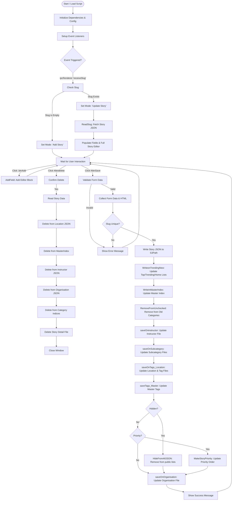

# Logic Flow for addStory.js

## Overview
`addStory.js` is an Electron renderer process script responsible for creating, updating, and deleting stories in the Workmob application. It interacts directly with AWS S3 APIs for all data and configuration storage, having fully migrated away from local file system dependencies.

## Flowchart

## detailed Function Descriptions

### 1. Initialization and Setup
*   **Dependencies**: Requires `@electron/remote`, `fs`, `path`, and standard Node modules.
*   **Configuration**: Loads `config.js` to get S3 paths (`activePathS3`).
*   **State**: Initializes lists for trending categories (e.g., `Need_trending_in`) and prepares checkboxes for cross-posting stories (e.g., "Stories Top", "Trending", "Mobile Home").

### 2. Event Handling
*   **`receiveSlug`**: The main entry point triggers when the main process sends a slug.
    *   If **new**: Sets up the form for adding a story.
    *   If **existing**: Calls `ReadSlug(slug)` to fetch the JSON file, parse it, and populate the form fields (Name, Slug, Category, tags, etc.) and the "Full Story" content editor.
*   **Content Editing**:
    *   Users can add blocks (Heading, Paragraph, Video, Image) which are rendered as selectable, editable DOM elements.
    *   The `GetFullStory(div)` function scrapes these DOM elements to reconstruct the HTML string for the story body.

### 3. Saving Process (`#btnSave`)
When the save button is clicked, the script executes a comprehensive chain of updates to ensure data consistency across the "S3" file structure:
1.  **Validation**: Checks for mandatory fields (Category, Location, Organisation, Instructor) and ensures the Slug is unique (if new).
2.  **`WriteS3Bucket`**: Writes the main story definition file (e.g., `story-detail/my-story.json`).
3.  **`WriteonTrendingNew`**: Updates specialized lists like `trending.json`, `mobile-home.json`, etc., adding or removing the story based on checkbox selection.
4.  **`WriteInMasterIndex`**: Updates `MasterIndex.json`, the central registry of all stories.
5.  **`RemoveFromUnchecked`**: If a story was moved from one category to another, this removes it from the old category's index.
6.  **`saveOninstructor`**: Adds the story to the specific instructor's JSON file.
7.  **`saveOnSubcategory`**: Adds the story to the relevant subcategory JSON files.
8.  **`saveOnTags_Location`**: Updates the specific Location file (e.g., `delhi.json`) and individual Tag files.
9.  **`saveTags_Master`**: Updates `TagsMaster.json` with any newly introduced tags.
10. **`HideFromAllJSON`**: If the "Hide" checkbox is selected, it aggressively removes the story from public lists (Trending, Location, Organisation) to ensure visibility control.
11. **`saveOnOrganisation`**: Updates the specific Organisation file (e.g., `workmob.json`).

### 4. Deletion Process (`#btndelete`)
Deletion is equally comprehensive to prevent orphaned records:
*   It reads the story first to know where it was referenced (which Instructor, Location, Organisation).
*   It sequentially removes the story entry from:
    *   Location File
    *   Master Index
    *   Instructor File
    *   Organisation File
    *   Category Index Files
    *   **Finally**, the Story Detail File itself.

## Migration to Full S3 API Usage (Partially Migrated)
The core data operations have been migrated to use AWS S3 APIs via `BucketConfigurations.js`. However, the configuration and template files are accessed from the local file system due to access issues with S3 config files.

### Current State
1.  **Form Schemas**: `RenderFields` reads schemas (like `story.json`) from the local `Files/` directory using `fs`.
2.  **Templates**: `templateTop.json` and `newStory.json` are read from the local `Files/` directory using `fs`.
3.  **Core Data**: Create, Read, Update, Delete operations for stories, categories, and indices use S3 APIs. 
4.  **Save Story**: The `WriteS3Bucket` call for saving the main story detail has been replaced with a direct API POST call.
